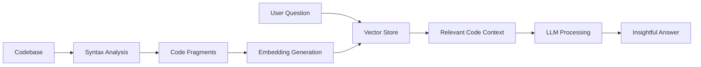

# CodeBuddy - AI Pair Programmer 🤖💻


CodeBuddy is an AI-powered pair programmer that helps you navigate and understand complex codebases by combining semantic code analysis with large language models.

## ✨ Key Features

- **🧠 Intelligent Code Understanding**: Uses Ollama's LLMs to provide context-aware code explanations
- **🔍 Semantic Search**: Finds relevant code snippets using vector embeddings
- **📊 Codebase Analysis**: Automatically extracts and indexes your project structure
- **💬 Interactive Chat**: Ask questions about your codebase in natural language
- **🌐 Multi-Language Support**: Works with any .NET project (C#, VB.NET, F#)

## 🚀 Why CodeBuddy?

- **Save time** finding where functionality is implemented
- **Understand legacy codebases** faster
- **Onboard new developers** more efficiently
- **Reduce knowledge silos** in your team
- **Get instant answers** about your code

## 🧩 How It Works



1. **Code Analysis**: Parses your solution using Roslyn-based LINQ provider
2. **Knowledge Extraction**: Creates semantic representations of classes, methods, and interfaces
3. **Vector Embedding**: Generates embeddings for all code fragments
4. **Context Retrieval**: Finds relevant code snippets for user questions
5. **AI Synthesis**: Combines context with LLM intelligence to generate answers

## ⚙️ Installation & Setup

### Prerequisites
- [.NET 9.0 SDK](https://dotnet.microsoft.com/download)
- [Ollama](https://ollama.com/) running locally

```bash
# Clone repository
git clone https://github.com/pwrmind/CodeBuddy.git
cd CodeBuddy

# Install required models
ollama pull llama3.1:latest
ollama pull nomic-embed-text:latest

# Build and run
dotnet run
```

## 🛠️ Usage

1. Start the application
2. Enter path to your solution
3. Ask questions about your codebase:
   - "How does the authentication system work?"
   - "Show me all API controllers"
   - "Explain the payment processing flow"
   - "Where is user validation implemented?"

```bash
Enter path to solution or project directory:
C:\Projects\MyApp

🔍 Analyzing codebase with LINQ provider...
📊 Extracted 247 code fragments
🧠 Building knowledge base...

💬 CodeBuddy is ready. Ask about your codebase (type '/exit' to quit)
==============================================================

You: Where is the shopping cart implemented?

CodeBuddy: 
🛒 The shopping cart functionality is implemented in:
1. ShoppingCartService (Services/ShoppingCartService.cs)
2. CartController (Controllers/CartController.cs)
3. Cart model (Models/Cart.cs)

Would you like me to show the implementation details?
```

## 📚 Supported Code Elements

| Element | Description | Example |
|---------|-------------|---------|
| 🧩 Classes | Class structure and members | `public class UserService` |
| ⚙️ Methods | Method signatures and implementations | `public void CalculateTotal()` |
| 🔌 Interfaces | Interface definitions | `public interface IPaymentProcessor` |
| 📦 Namespaces | Namespace organization | `namespace ECommerce.Services` |
| 📝 Documentation | XML code comments | `/// <summary>User management</summary>` |

## 🤝 Contributing

We welcome contributions! Please follow these steps:

1. Fork the repository
2. Create your feature branch (`git checkout -b feature/AmazingFeature`)
3. Commit your changes (`git commit -m 'Add some amazing feature'`)
4. Push to the branch (`git push origin feature/AmazingFeature`)
5. Open a pull request

## 📜 License

Distributed under the GNUV3 License. See `LICENSE` for more information.

## ✉️ Contact

Project Maintainer - [PWRMind]

Project Link: [https://github.com/pwrmind/CodeBuddy](https://github.com/pwrmind/CodeBuddy)

---

Made with ❤️ and ☕ by [PWRMind/Team] | [](https://github.com/pwrmind/CodeBuddy)